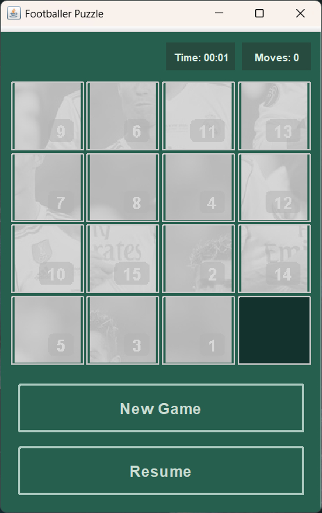
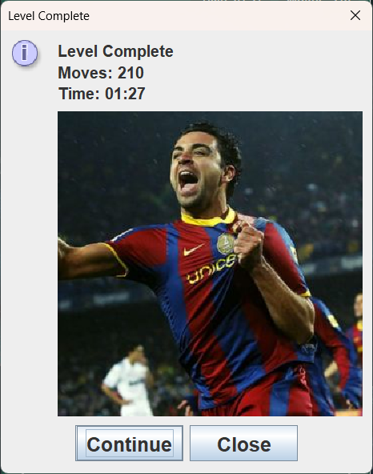

# 🎮 GUI Mini Project 2025

## 📌 Overview
**GUI Mini Project 2025** is a Java Swing-based puzzle game developed as part of the OOP (Object-Oriented Programming) coursework. The game demonstrates key OOP principles such as **Encapsulation**, **Abstraction**, **Inheritance**, and **Polymorphism**, while also applying **MVC (Model-View-Controller)** architecture for better maintainability and separation of concerns.

The project includes:
- A **15-Puzzle style sliding game** with images.
- **Scoring system** to track player performance.
- **Pause/Resume functionality** for smoother gameplay.
- **Endgame screen** showing the completed image and score.

---

## 🛠️ Features
- 🎲 **15-Puzzle Gameplay**: Rearrange shuffled tiles to restore the full image.
- 🔢 **Numbered Tiles**: Numbers on tiles help players solve puzzles easier.
- 🆕 **New Game**: Randomly generates a new puzzle with different images.
- ⏸️ **Pause & Resume**: Game can be paused and resumed anytime.
- ⏱️ **Timer & Moves Counter**: Tracks elapsed time and number of moves.
- 🏆 **Completion Screen**: Shows the final image and player statistics when solved.
- 🖥️ **MVC Design Pattern**: Code structured into Model, View, and Controller.

---

## 📂 Project Structure
```
GUI-Mini-Project-2025/
│── Game/
│   ├── model/          # Game logic, puzzle state, scoring
│   │   ├── PuzzleTile.java
│   │   ├── PuzzleBoard.java
│   │   └── PuzzleGame.java
│   │
│   ├── view/           # GUI components
│   │   └── PuzzleUI.java
│   │
│   ├── controller/     # Main window, menus, image handling
│   │   ├── FootballerPuzzle.java
│   │   └── ImageManager.java
│   │
│   └── Main.java       # Entry point of the application
│
│── resources/          # Images and assets for the puzzle
│── README.md           # Project documentation
```

---

## 🚀 How to Run
1. **Clone the repository**
   ```bash
   git clone https://github.com/PhuriphatiZAMU/GUI-Mini-Project-2025.git
   cd GUI-Mini-Project-2025/Game
   ```

2. **Compile the project**
   ```bash
   javac Main.java
   ```

3. **Run the project**
   ```bash
   java Main
   ```

> ⚠️ Ensure you are using **Java 17+** (JDK 17 or higher).

---

## 🎯 System Design (from Documentation)
### **Model**
- **PuzzleTile**: Represents each tile (id, image, empty check).
- **PuzzleBoard**: Holds grid of tiles, checks valid moves, determines solved state.
- **PuzzleGame**: Manages game logic, moves, timer, pause, and events.

### **View & Controller**
- **PuzzleUI**: Handles the puzzle board display, button styles, and updates.
- **FootballerPuzzle**: JFrame main window, menu bar, integrates PuzzleUI.
- **ImageManager**: Loads, randomizes, and manages puzzle images.

---

## 🔄 System Flow
1. **Start Game** → Load `PuzzleUI` with `PuzzleGame`.
2. **New Game** → Random image sliced into tiles.
3. **Player Moves** → Click tile, validate move, update UI & counter.
4. **Check Solved**:
   - If not solved → Continue gameplay.
   - If solved → Show full image, time, and moves.
5. **Pause/Resume** → Toggle gameplay state anytime.

---

## 🎯 OOP Concepts Applied
- **Encapsulation**: Puzzle state and logic hidden in `model` classes.
- **Abstraction**: Separation of game logic from UI via MVC.
- **Inheritance**: `JFrame`, `JPanel` extensions for custom GUI.
- **Polymorphism**: Overridden methods for GUI behavior and flexible event handling.
- **MVC Pattern**: Clear separation of **Model** (logic), **View** (UI), **Controller** (game control).

---

## 📸 Screenshots


### Gameplay


### Pause/Resume


### Newgame


### Completed Puzzle

---

## 👥 Contributors
- **Phuriphat Hemakul** ([@PhuriphatiZAMU](https://github.com/PhuriphatiZAMU))
- **Kitkhachon Chirawongrungrueang** ([@Kitkhachon-xx](https://github.com/Kitkhachon-xx))

---

## 📜 License

This project is intended for educational and non-commercial use.

> ⭐ If you find the code useful, feel free to star the repository!

